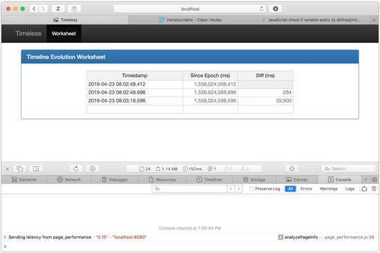

# Simple Time Interval Calculations

Log files are great, but they don't always make determining the _elapsed time_
betwwn events all that easy to calculate. This service and app, is all about
making the calculation of those time intervals very easy.

<p align="center">
  
</p>

## RESTful Endpoints for the Service

<p align="center">
  
</p>

There are several RESTful endpoints of this service that the application makes
use of - and are free to be used by any caller.

## Development

### UI

Frontend developers can drop HTML, CSS, JavaScript, etc. in `resources/public/`.

We're using [Bootstrap](http://getbootstrap.com/) and [jQuery](https://jquery.com/). No fancy pre-processors or crazy frameworks (yet).

### Necessary Tools

**[Homebrew](http://brew.sh/)** - all of the following tools can be installed with Homebrew. If it's not already installed on your laptop, it's easy enough to go to the website, run the command to install it, and then continue to the next step. If you are on linux, expect to be installing some scripts and RPMs, but everything is available there as well - just not as convenient.

**[JDK 1.8](http://www.oracle.com/technetwork/java/javase/downloads/index.html)** - it is possible to get JDK 1.8 from Oracle, but it's just as easy to get the JDK 1.8 from AdoptOpenJDK, and not have to worry about Oracle's licensing. Simply:
```bash
$ brew tap AdoptOpenJDK/openjdk
$ brew cask install adoptopenjdk8
```

**[Leiningen](http://leiningen.org/)** - it is the _Swiss army knife_ of Clojure development - library version control, build, test, run, deploy tool all in one with the ability to create extensions. On the Mac, this is installed easily with:
```bash
$ brew install leiningen
```
and on linux you can download the [lein script](https://raw.githubusercontent.com/technomancy/leiningen/stable/bin/lein) to _somewhere_ in your `$PATH`, and make it executable. Then:
```bash
$ lein
```
and it'll download everything it needs to run.

**[Heroku](http://heroku.com/)** - there is no simpler place to host a solid
service/app than Heroku - and these are the tools necessary to deploy to your
own dyno on their service. They are installed easily with:
```bash
$ brew install heroku/brew/heroku
```
and if you follow along on the Heroku [Getting Started with Clojure](https://devcenter.heroku.com/articles/getting-started-with-clojure?singlepage=true)
page, you'll be ready to go in no time.

### Running the REPL

Once the repo is down and the necessary tools are installed, you can run the clojure REPL, this allows you to run and work with the code in an interactive shell. Simply:
```bash
$ cd timeless
$ lein repl
nREPL server started on port 53731 on host 127.0.0.1 - nrepl://127.0.0.1:53731
REPL-y 0.3.7, nREPL 0.2.12
Clojure 1.8.0
Java HotSpot(TM) 64-Bit Server VM 1.8.0_71-b15
    Docs: (doc function-name-here)
          (find-doc "part-of-name-here")
  Source: (source function-name-here)
 Javadoc: (javadoc java-object-or-class-here)
    Exit: Control+D or (exit) or (quit)
 Results: Stored in vars *1, *2, *3, an exception in *e

timeless.main=>
```
at this point, you are live with the code and can run the functions as you wish.

### Running the Tests

[Leiningen](http://leiningen.org/) also controls the tests. These are in the directory structure:
```
  timeless
   |-- test
       |-- timeless
           |-- test
               |-- core.clj
         ...
```
and you can run all of them with the simple command:
```bash
$ lein test
```
There are, of course, lots of options and testing capabilities, but if the tests are written right, then this will result in something like:
```bash
Testing timeless.test.core

Ran 1 tests containing 3 assertions.
0 failures, 0 errors.
```
If there are errors, they will be listed, with the expected vs. actual also provided to assist in debugging the problem with the tests.

### Running the Web Server

The current code has a RESTful service to accept workflow events as well as respond to simple queries. To run the service on your local machine, against the currently defined postgres instance simply:
```bash
$ lein run web
```
and then you can monitor the log:
```bash
$ tail -f log/timeless.log
```

At this point, point a browser to `https://localhost:8443/info` and you should see the basic data about the service. Point it to `https://localhost:8443/` and you'll see the opening page.

### Update the Version Number in `project.clj`

Each deployment will require a new version number, and the rules are very simple:

* if **all** changes are Bug Fixes, then increment the _smallest_ value in the version.
* if **any** change made _**breaks**_ the external API, then increment the _largest_ value in the version.
* if it's anything else - increment the _middle_ number in the version.

These are simple rules. If you did _more_ than Bug Fixes, but broke no external APIs, then it's a _middle_ version number fix. If you broke existing APIs, then it's a _large_ number change - even if you added other features and fixed bugs.

The version number must change, and the release notes should be updated as well. But
there is no room for discussion on what should change - the rules are very clear.

### Add Release Notes to `CHANGELOG.md`

There is a `CHANGELOG.md` file at the root of this repo, and there should _always_
be at least a record of the release, including a list of what's been fixed and
added - or changed - so that no one has to go looking in the git commits to get
the _**basics**_ on what is in this release.

The format is already established in the file, so it's easy to just copy the last
entry, change the information and save. Simple. But **very** important.

### Tag the Git Repo with the New Version

Once you have updated the version in the `project.clj` file, and written the release notes, you need to check everything in and tag the git repo with the version. This is simple:
```bash
$ git tag -a v1.2.1
```
and supply a concise, reasonable, sentence for this version tag. Please note the `v`
on the front of the tag. This will make things more uniform for all version tags.

You can then push the tag with:
```bash
$ git push --tags
```
